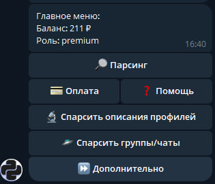
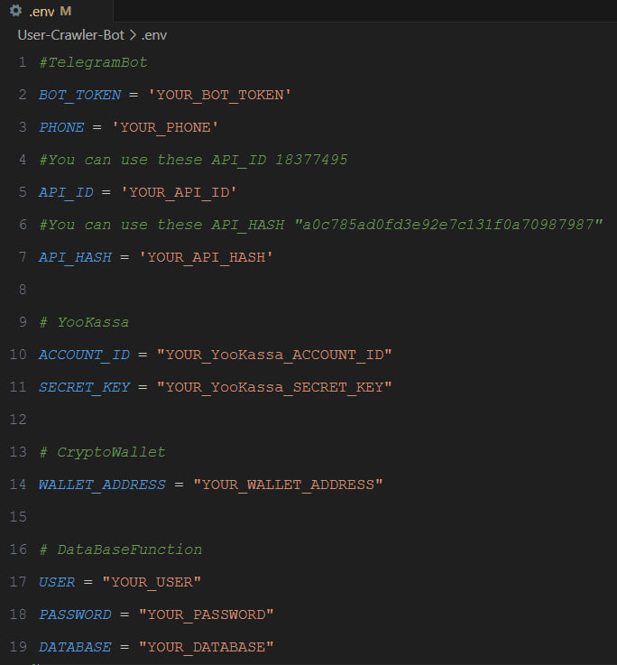

# User Crawler Bot

этот бот поможет вам автоматизировать множество задач и сделать ваше время в telegram более продуктивным.



## Navigation

1. [Features](#features) ✨

2. [Stack](#stack) 🛠️

3. [Quick Start](#quick-start) 🚀

## Features

- **Парсинг никнеймов:** 📂 Собирайте никнеймы участников групп и чатов.

- **Парсинг описания профилей:** 📝 Собирайте описания профилей участников. их онлайн, имя, фамилию, никнейм, номер телефона.

- **Поиск групп и чатов по ключевым словам:** 🔍 Найдите группы и чаты по ключевым словам.

- **Фильтрация пользователей по дате активности:** 📅 Фильтруйте собранных пользователей по последней активности.

- **Реферальная программа:** 🎁 за приглашенных друзей начисляются бонусы.

- **Оплата подписки:** 🌟 функция оплаты подписки для более быстрой работы бота.

- **Пополнение баланса:** 💳 Пополнение счета через криптовалюту и юкассу.

## Stack

- Python
- Aiogram
- Asyncpg (PostgreSQL)
- Beautifulsoup4
- Telethon
- Pydantic
- Python-Dotenv
- Requests

## Quick Start

Выполните следующие шаги, чтобы настроить проект локально на вашем компьютере.

### Предварительные условия

Убедитесь, что на вашем компьютере установлено следующее:

- [Git](https://git-scm.com/downloads)
- [Python](https://www.python.org/downloads/)
- [PostgreSQL](https://www.postgresql.org/download/)

**Клонирование репозитория**

```sh
git clone https://github.com/avariceJS/User-Crawler-Bot.git
cd User-Crawler-Bot
```

**Установка зависимостей**

```sh
python -m venv myenv

# Windows:
myenv\Scripts\activate

# macOS/Linux:
source myenv/bin/activate

pip install -r requirements.txt
```

**Укажите данные в ".env" файл**



**Запуск проекта**

```sh
python bot.py
```

Запустите вашего бота в telegram командой "/start"